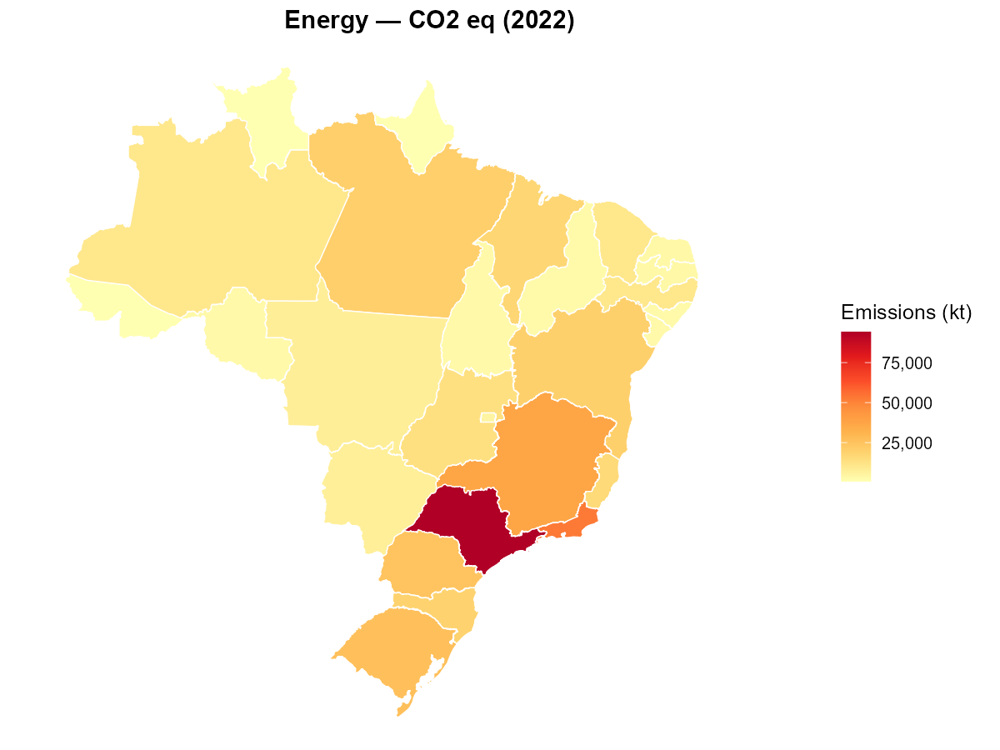

# epebdmc 

<!-- badges: start -->

<!-- badges: end -->

Brazilian greenhouse gas emissions data at your fingertips. `epebdmc`
downloads, stores, and serves GHG emissions data from Brazil’s official
inventory — ready to query, plot, map, and export with simple R
functions.

## What’s Inside

- **Data**: GHG emissions for all 27 Brazilian states (1990–2022),
  across 5 IPCC sectors and 7 gas types, from the First Biennial
  Transparency Report (BTR1/MCTI)
- **One-call setup**: `setup_btr1()` downloads everything and builds a
  local database
- **Flexible queries**: filter by state, sector, gas, year, or region
- **Visualizations**: time series, rankings, and choropleth maps
- **Export**: save filtered data as CSV or Excel

## Installation

``` r
# install.packages("devtools")
devtools::install_github("abreucarvalho/epebdmc")
```

## Quick Start

``` r
library(epebdmc)

# Set up the database (run once — downloads data from MCTI)
setup_btr1()

# Query: Energy sector emissions for São Paulo
get_emissions(sector = "Energy", uf = "SP", year = 2010:2022)
```

## Query Examples

All functions share the same filter vocabulary: `sector`, `uf`, `gas`,
`year`, `region`.

``` r
# CO2 equivalent emissions for Rio de Janeiro
get_emissions(uf = "RJ")

# Compare all gases for Minas Gerais
get_emissions(uf = "MG", gas = c("CO2", "CH4", "N2O"))

# Nordeste region, LULUCF sector, 2000 onwards
get_emissions(sector = "LULUCF", region = "Nordeste", year = 2000:2022)

# Use IBGE codes
get_emissions(uf = c(33, 35), sector = "Energy")  # RJ + SP
```

## Visualizations

### Time Series

``` r
# Energy emissions over time for Sudeste states
plot_emissions(sector = "Energy", region = "Sudeste")

# Compare sectors for one state
plot_emissions(uf = "SP", colorBy = "sector")
```

### Rankings

``` r
# Top 10 emitting states in 2022
plot_ranking(sector = "Energy", year = 2022, topN = 10)
```

### Choropleth Maps

Requires `geobr` and `sf` packages.

``` r
# Emissions by state
plot_map(sector = "Energy", year = 2022)

# Change between two years (green = decrease, red = increase)
plot_map_change(sector = "LULUCF", yearFrom = 1990, yearTo = 2022)
```

<figure>

<figcaption aria-hidden="true">Energy emissions by state,
2022</figcaption>
</figure>

## Export

``` r
# CSV
export_emissions(path = "energy_sudeste.csv", sector = "Energy", region = "Sudeste")

# Excel
export_emissions(path = "all_emissions.xlsx")
```

## Data Source

All data comes from the **Ministry of Science, Technology and Innovation
(MCTI)** via the [SIRENE
platform](https://www.gov.br/mcti/pt-br/acompanhe-o-mcti/cgcl/clima) —
Brazil’s official greenhouse gas inventory system.

|               |                                           |
|---------------|-------------------------------------------|
| **Report**    | First Biennial Transparency Report (BTR1) |
| **Sectors**   | Energy, IPPU, Agriculture, LULUCF, Waste  |
| **Gases**     | CO₂ eq, CO₂, CH₄, N₂O, HFCs, PFCs, SF₆    |
| **Coverage**  | 27 states + Distrito Federal              |
| **Period**    | 1990–2022                                 |
| **Framework** | UNFCCC / Paris Agreement (Article 13)     |

## Learn More

``` r
vignette("usage-guide", package = "epebdmc")
vignette("how-epebdmc-was-built", package = "epebdmc")
vignette("migration-sqlite-to-sqlserver", package = "epebdmc")
```

## Variable Naming Convention

Column and table names follow the convention defined in
[TIC-DAD-02](inst/config/schemas_sqlite.sql), using camelCase with class
prefixes:

| Prefix | Class       | Example             |
|--------|-------------|---------------------|
| `cod`  | Code        | `codAgente`         |
| `dat`  | Date        | `datInicioVigencia` |
| `ind`  | Indicator   | `indAtivo`          |
| `nom`  | Name        | `nomFuncionario`    |
| `num`  | Number      | `numTelefone`       |
| `val`  | Value       | `valSalario`        |
| `qtd`  | Quantity    | `qtdBrocas`         |
| `mdd`  | Measurement | `mddPetroleo`       |

Table prefixes: `Dim` (dimension), `Fat`/`fact` (fact), `Hist`
(history).

## License

MIT
